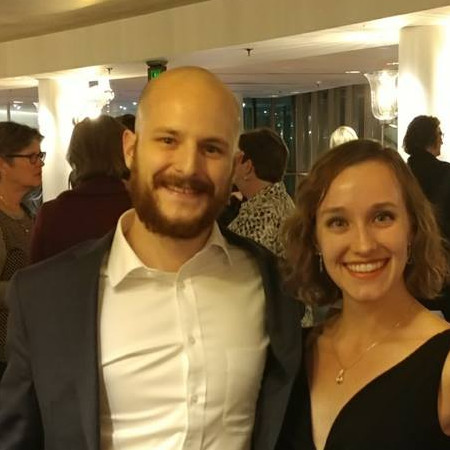

 
Biological Lab Researcher with 7 years experience.  
  
  
  
  

Works include organic chemistry ligand development for antibody aggregate filtration, SERS UV-vis aflatoxin detection systems, and molecular biology for LAMP-BART PCR detection of food-borne pathogens.

>"Our world is built on biology, once we begin to understand it, it then becomes a technology." - Ryan Bethencourt

